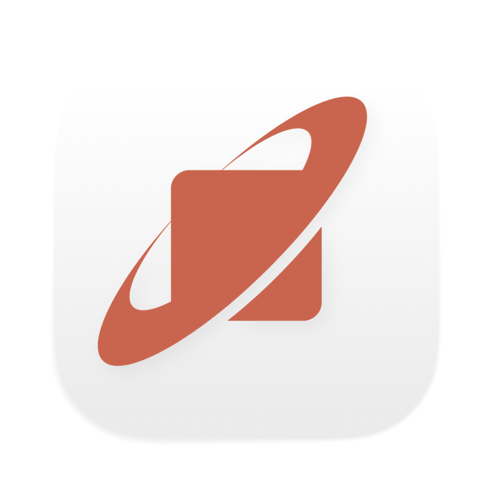

<p align="center">
  
</p>

<h1 align="center">Orbit</h1>

<p align="center">
  <strong>Built for the way software gets built now.</strong><br/>
  AI-native development environment. Full context. Zero switching. One agent across everything you build with.
</p>

<p align="center">
  <a href="https://github.com/Recusive/Orbit/actions/workflows/ci.yml"></a>
  
  
  
  
  
</p>

---

## What is Orbit

Orbit is an AI-native development environment — a native desktop app where one AI agent works across every surface you build with: editor, browser, terminal, and docs. The agent builds its own context from all of these surfaces rather than relying on you to provide it.

In most AI coding tools, the agent writes code but can't see your running app. You copy error logs from the browser and paste them into the chat. You screenshot a UI bug and describe it. The agent works with whatever context you give it — and wrong context means wrong code.

Orbit eliminates that gap. The agent takes screenshots of your browser. It reads your terminal output. It sees your code. It reads your docs. It builds its own understanding instead of depending on yours.

---

## Agent

- Full conversational AI agent powered by the Claude Agent SDK
- Sub-agents for delegated, parallel task execution
- Plan-first mode (shows plan, you approve) or direct execution
- Slash commands and a skills system with 20,000+ community skills via [skills.sh](https://skills.sh)
- Plugin architecture and built-in MCP server creator
- Claude OAuth (Free, Pro, Max) or bring your own Anthropic API key

## Editor

- CodeMirror 6 with full language server protocol (LSP) support
- Syntax highlighting, autocomplete, and code intelligence
- Complete file system access and management
- Git end-to-end — staging, commits, branches, merges, diffs, history, push/pull

## Browser

- Embedded browser inside the development environment
- Agent takes screenshots — it visually sees your running app
- Full autonomous control — navigate, click, scroll, fill forms
- Click-to-select: click any element in your running app, then tell the agent what to change

## Terminal

- Integrated terminal with tabbed interface
- Agent has full terminal access for commands, scripts, and process management

## Vault

- Built-in markdown editor for notes, documentation, planning, and PRDs
- Agent reads vault content as context while building

---

## Architecture

Orbit is a Tauri 2 desktop app with a Rust backend, React 19 frontend, and a Bun-compiled sidecar that wraps the Claude Agent SDK.

```
React Frontend (Webview)
        |
    Tauri IPC
        |
Rust Backend ── File system, Git, Terminal, LSP, Search
        |
  Agent Bridge (Bun sidecar) ── Claude Agent SDK ── Claude API
```

---

## What V1 Does Not Have

- **No VS Code extensions** — Orbit has its own skills/plugin system
- **No inline code completions** — all AI interaction is through the agent
- **Claude only** — multi-model support is on the roadmap
- **macOS only** (Apple Silicon) — Windows and Linux coming
- **No canvas/whiteboard**
- **No one-click deploy**

---

## Roadmap

- Multi-model support (OpenAI, Google, local models)
- Windows and Linux builds
- Specialized agents: Tester, PR Reviewer, Research, DevOps
- Visual canvas / design surface
- Inline code completions
- One-click deploy integration

---

Built by [Recursive Labs](https://orbit.build)
