# Chat Virtualization System

> Measure once. Use forever. Never re-render what hasn't changed.



_Source: [virtualization-flow.mmd](./virtualization-flow.mmd) — rendered with tokyo-night theme via pretty-mermaid._

## Overview

The chat message list uses [TanStack Virtual](https://tanstack.com/virtual) to virtualize potentially hundreds of messages, each containing rich markdown rendered by Streamdown + Shiki syntax highlighting. The virtualization system is designed around one principle: **messages are measured exactly once, and that measurement is reused for the lifetime of the message.**

## Architecture

```
┌────────────────────────────────────────────────────────────────────┐
│                        TanStack Virtual                             │
│                                                                    │
│  estimateSize(index)           ──► cachedSizeMapRef (initial hint) │
│  measureElement(el, entry)     ──► ref-attach: return cached       │
│                                    RO fire:    read DOM, update    │
│                                                                    │
│  shouldAdjustScrollPositionOn  ──► suppressed for 250ms after any  │
│  ItemSizeChange                    scroll event (velocity-aware)   │
└──────────────┬─────────────────────────────┬───────────────────────┘
               │                             │
               ▼                             ▼
┌──────────────────────────┐  ┌──────────────────────────────────┐
│   FlowTokenSegment       │  │   Render Cache Store             │
│                          │  │   (render-cache-store.ts)        │
│  HIT:  dangerouslySet    │  │                                  │
│        InnerHTML          │  │  Memory: Map<sessionKey:msgId,   │
│  MISS: live Streamdown   │  │          size>                   │
│        → write-through   │  │  IndexedDB: orbit-render-cache   │
│        cache after Shiki │  │                                  │
│        settles (80ms)    │  │  Only `measured: true` entries   │
└──────────────┬───────────┘  │  (truly post-Shiki settled)      │
               │              │  load into cachedSizeMapRef       │
               ▼              └──────────────────────────────────┘
┌──────────────────────────┐
│   Streamdown Cache       │
│   (streamdown-cache.ts)  │
│                          │
│  Memory: Map<contentHash,│
│          {html, height}> │
│  IndexedDB:              │
│    orbit-streamdown-cache│
│                          │
│  Keyed by djb2 hash of   │
│  segment text. Each      │
│  FlowTokenSegment gets   │
│  its own entry.          │
└──────────────────────────┘
```

## Two Cache Layers

### 1. Render Cache Store (`render-cache-store.ts`)

**Purpose:** Stores the exact pixel height of every message row (the full `div` that TanStack measures, including padding, tool widgets, thinking blocks, action bar).

**Key:** `${sessionKey}:${messageId}` (TanStack's item key)

**Used by:**

- `estimateSize()` — returns the cached height as the initial estimate
- `measureElement()` — uses cached sizes differently depending on the call reason:
  - **Ref-attach (entry === undefined):** returns cached size so TanStack positions the row at its final height immediately, even before the DOM has rendered content
  - **ResizeObserver fire (entry !== undefined):** always reads the real DOM, updates the cache with the latest value, and un-settles the row. This ensures the cache tracks actual rendered sizes through Streamdown → Shiki → final, and never gets stuck on a pre-render placeholder

**Lifecycle:**

1. First visit: TanStack measures rows via ResizeObserver → each fire updates `cachedSizeMapRef`
2. Row "settles" (500ms quiet window with no new fires) → added to `settledKeysRef`
3. `snapshotMeasurementCache()` persists to IndexedDB with `measured: true` only for settled rows
4. Second visit: loaded from IndexedDB, filtered to `measured: true` entries → `cachedSizeMapRef`
5. Ref-attach returns cached → DOM renders at correct final size → no delta, no jitter

### 2. Streamdown Cache (`streamdown-cache.ts`)

**Purpose:** Stores the pre-rendered HTML output and content height of each FlowTokenSegment.

**Key:** `djb2(segmentText)` — content hash, not message ID. This handles multi-segment messages (tool interleaving splits one message into multiple FlowTokenSegments).

**Used by:**

- `FlowTokenSegment` — on cache hit, renders via `dangerouslySetInnerHTML` (~0.05ms) instead of running the full Streamdown + Shiki pipeline (~1.5ms)

**Lifecycle:**

1. First mount: live Streamdown render (MISS)
2. After Shiki settles (80ms MutationObserver debounce): captures `innerHTML` + `getBoundingClientRect().height` → writes to cache
3. Remount (TanStack unmounts/remounts on scroll): cache HIT → `dangerouslySetInnerHTML`

## The Measure-Once Pipeline

### New Message (Streaming → Complete)

```
1. Message streams in
   └─ FlowTokenSegment renders with isStreaming=true
   └─ No cache interaction (streaming content is mutable)

2. agent:complete fires
   └─ isStreaming set to false
   └─ FlowTokenSegment re-renders as completed
   └─ Write-through: MutationObserver waits 80ms for Shiki
   └─ Captures innerHTML + height → streamdown-cache (memory + IndexedDB)

3. ResizeObserver fires per row (initial mount, Shiki callback, etc.)
   └─ measureElement records timestamp in lastMeasureAtRef
   └─ If re-fire within quiet window: row un-settled
   └─ scheduleSettleCheck debounces a check

4. ROW_SETTLE_MS (500ms) elapses with no new fires for a row
   └─ Row marked in settledKeysRef (truly post-Shiki final height)
   └─ snapshotMeasurementCache fires
   └─ Only rows in settledKeysRef persisted as `measured: true`
   └─ Pre-settle values (placeholder heights) marked `measured: false`

5. User scrolls away and back
   └─ TanStack unmounts the item (leaves viewport)
   └─ TanStack remounts the item (re-enters viewport)
   └─ estimateSize → cachedSizeMapRef → exact height
   └─ measureElement → cachedSizeMapRef → exact height (delta = 0)
   └─ FlowTokenSegment → streamdown-cache HIT → dangerouslySetInnerHTML
   └─ No Streamdown render, no Shiki, no measurement cascade
```

### Revisiting a Session (Cold Switch)

```
1. App starts
   └─ warmMemoryCacheFromIdb() loads render caches from IndexedDB
   └─ warmStreamdownCache() loads HTML caches from IndexedDB

2. User selects session
   └─ useLayoutEffect filters cache entries: ONLY `measured: true` rows
     (truly post-Shiki settled) are loaded into cachedSizeMapRef
   └─ Pre-settle/estimated entries are discarded — never cause positioning
     errors (blank rows, overlaps)
   └─ TanStack renders visible items
   └─ estimateSize → cached row heights (exact)
   └─ measureElement → cached row heights (delta = 0)
   └─ FlowTokenSegment → streamdown-cache HIT → instant HTML

3. Result: no measurement cascade, no scroll jitter
```

### Adding a New Message to an Existing Session

```
1. User sends message, agent responds
2. Only the NEW message goes through the live render path
3. Existing messages use cached heights + cached HTML
4. On agent:complete, snapshot extends the cache with the new message
5. All previous measurements remain untouched
```

## Why This Solves Scroll Jitter and Pushback

Two separate problems had to be fixed:

### 1. Jitter from Measurement Deltas

When TanStack remounts an item during scroll:

1. `estimateSize()` returns a height (e.g., 470px)
2. ResizeObserver fires → default `measureElement()` reads DOM (e.g., 468px)
3. Delta = -2px → `shouldAdjustScrollPositionOnItemSizeChange` fires
4. ScrollTop shifts → scroll event → range recalculation → more mounts → more deltas → cascade

**The fix:** On ref-attach, `measureElement` returns the cached height (same value as `estimateSize`) so TanStack positions the row at the correct final size from frame 1. Once the DOM renders at that same height (via streamdown-cache HTML injection), the subsequent ResizeObserver fire returns the same value → delta = 0 → no adjustment.

### 2. Pushback During Velocity Scroll

The `useVelocityScroll` hook writes `scrollTop` directly in a RAF loop, which bypasses TanStack's internal `isScrolling` tracking. This meant `shouldAdjustScrollPositionOnItemSizeChange` could fire during fast scrolling, producing the "4-up, 2-back" pushback as above-viewport rows measured differently than estimated.

**The fix:** `lastScrollAtRef` records the timestamp of every scroll event. The `shouldAdjust` guard suppresses compensation for 250ms after any scroll event — bridging the gap where TanStack's own `isScrolling` misses velocity animations. User gestures no longer fight TanStack's scroll compensation.

## Key Design Decisions

### Content Hash Keying (Not Message ID)

The streamdown cache uses `djb2(segmentText)` as the key, not the message ID. This is because:

- **Multi-segment messages:** Assistant messages with tool interleaving are split into multiple `FlowTokenSegment` instances by `buildUnifiedSegments()`. Each segment is a substring of the full message content. Using message ID would require knowing which segment to look up.
- **Deduplication:** Identical text in different messages shares one cache entry.
- **Independence:** Each segment's cache entry is self-contained — no dependency on message structure.

### Write-Through (Not Background Pre-Render)

The cache is populated by live renders, not a background service:

- **Accurate:** The cached HTML comes from the actual rendered DOM, not a hidden container that might differ.
- **Segment-aware:** Each FlowTokenSegment captures its own output, handling multi-segment messages naturally.
- **No timing issues:** No race between background rendering and user scrolling.

A background render service exists (`streamdown-render-service.ts`) for potential pre-warming of future sessions, but the write-through cache is the primary mechanism.

### MutationObserver Settle (80ms)

Shiki syntax highlighting is async — `code.highlight()` returns null on first call and fires a callback when ready. Streamdown re-renders the code block after the callback. The MutationObserver debounce (80ms quiet window) ensures we capture the final highlighted HTML, not the intermediate unhighlighted version.

### Settle-Gated Snapshot (500ms Per-Row)

Persisted row heights must be post-Shiki, post-font-load, post-all-async-rendering. A session-wide timer (e.g., 300ms after `isAgentRunning` transitions false) is unreliable — some messages might still be in Shiki callback hell when the timer fires.

Instead, each row has its own quiet-window timer. When TanStack's ResizeObserver fires for a row, we record the timestamp. `ROW_SETTLE_MS` (500ms) later, if no new fires happened for that row, it's marked in `settledKeysRef`. Only these keys are persisted as `measured: true` to IndexedDB.

If Shiki fires again mid-window (re-render after grammar loads), the row is un-settled and the timer resets. This guarantees captured heights are always the final rendered heights — never pre-Shiki placeholders.

On revisit, only entries with `measured: true` load into `cachedSizeMapRef`. Pre-settle/estimated entries are discarded — preventing the blank/overlap positioning errors that stale heights would cause.

### Viewport Width Validation (16px Tolerance)

Cached heights depend on text wrapping, which depends on container width. Each cache entry stores the viewport width at render time. On lookup, widths are compared with 16px tolerance — enough to absorb OS-level DPI rounding and scrollbar appearance, but catches actual window resizes that affect line breaks.

### Scroll-Activity Guard (250ms Window)

`shouldAdjustScrollPositionOnItemSizeChange` is TanStack's mechanism for keeping visible content anchored when above-viewport rows grow — useful during streaming, harmful during active scrolling (it fights the user's scroll). TanStack's built-in `isScrolling` detects native scroll events but misses velocity-driven `scrollTop` writes.

A plain scroll-event listener records `lastScrollAtRef` on every scroll (native or velocity-driven). The `shouldAdjust` guard returns `false` if any scroll event happened within the last 250ms. This covers the velocity animation window cleanly without needing to couple directly to the velocity hook.

### One-Time Cache Reset (localStorage Sentinel)

When the measurement-storage schema changes in incompatible ways (e.g., the `measured` flag going from "set on everything" to "set only on truly settled"), existing IndexedDB entries are invalid. Rather than relying on IndexedDB's `onupgradeneeded` migration, `main.tsx` uses a localStorage sentinel (`orbit-cache-reset-v3`) to purge both caches exactly once per user. The sentinel is set after successful purge, so subsequent boots skip the cleanup. To force another reset after a future schema change, bump the sentinel name.

## Files

| File                                         | Purpose                                                                                                      |
| -------------------------------------------- | ------------------------------------------------------------------------------------------------------------ |
| `lib/chat/streamdown-cache.ts`               | Dual-layer HTML cache (memory LRU 2000 + IndexedDB) keyed by content hash                                    |
| `lib/chat/streamdown-config.tsx`             | Shared Streamdown + Shiki plugin config (used by both MessageItem and render service)                        |
| `lib/chat/streamdown-render-utils.ts`        | `getChatContentWidth()` + viewport width change tracking                                                     |
| `services/chat/streamdown-render-service.ts` | Background pre-render service (bonus, not primary)                                                           |
| `stores/chat/render-cache-store.ts`          | Per-session row height cache (memory + IndexedDB)                                                            |
| `components/chat/chat-messages.tsx`          | TanStack Virtual setup: `estimateSize`, `measureElement`, `cachedSizeMapRef`, `settledKeysRef`, scroll guard |
| `components/chat/messages/MessageItem.tsx`   | `FlowTokenSegment` write-through cache                                                                       |
| `main.tsx`                                   | One-time IndexedDB cache reset (`orbit-cache-reset-v3` sentinel)                                             |

## Testing

29 integration tests in `__tests__/unit/lib/chat/streamdown-cache-pipeline.test.tsx` cover:

- **Layer 1 — Cache module:** Hash stability, miss→write→hit, width tolerance, invalidation, multi-segment
- **Layer 2 — Write-through capture:** MutationObserver settle → cache write, streaming skip, dangerouslySetInnerHTML on remount
- **Layer 3 — measureElement override:** Cached size return, fallthrough on miss, multi-message sessions
- **Layer 4 — Stream-end trigger:** `isAgentRunning` transition detection, cleanup on unmount, rapid toggle (multi-turn)
- **Layer 5 — Settle-gated snapshot:** Quiet-window detection, re-fire un-settles, independent row timelines, Shiki lifecycle simulation, snapshot fires only on new settles
- **Full pipeline:** Stream→measure→cache→revisit lifecycle, incremental new message extension
